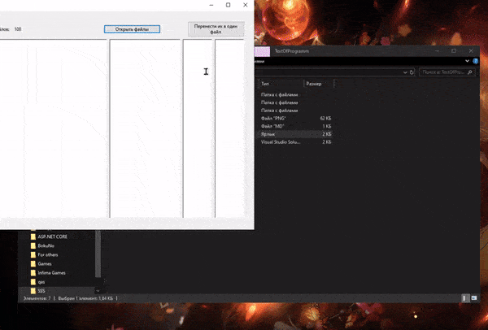

____

<h2 align=center>Прога чтобы сделать текст программы - загружаешь файлы, она дает текст файлов, их названия и размер в кб</h2>
<h4 align=center> все что остается когда в ворд пихнули - через найти и заменить убрать символ-сепаратор. по умолчанию он ~. символ-сепаратор можно изменить</h3>

## **Installation**

скачать .exe файлы можно из <a href="https://github.com/Liromanz/TextOfProgramm/releases">**Releases**</a>. поддерживается .net 5, .net 6, .net 7, .net 8 и .net 9

## **Usage**

## **Show your support**
Leave a ⭐ if you like this project

_README made by <a href="https://github.com/HanamiLux">Hanamis</a>_
